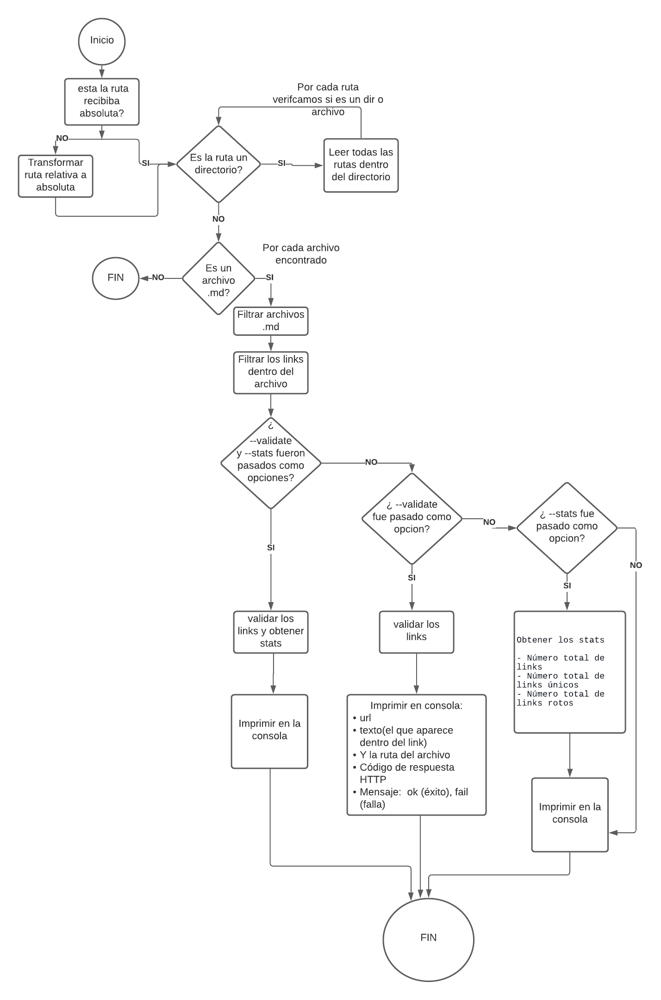

# Markdown Links

## Índice

* [1. Objetivo del proyecto](#1-objetivo-del-proyecto)
* [2. CLI](#2-cli)
* [3. Diagrama de flujo](#3-diagrama-de-flujo)

***

## 1. Objetivo del proyecto

En este proyecto se ha creado una herramienta de línea de comando (CLI) así como una librería en JavaScript que se pretende lea y analice archivos en formato Markdown, para verificar los links que contengan y reportar algunas estadísticas.

## 2. CLI

Las instrucciones para poder validar links que están dentro de archivos .md son las siguientes:

mdlink ruta --validate ---> Para validar los links
mdlink ruta --stats ---> Para obtener las estadísticas de los links totales y únicos
mdlink ruta --validate --stats ---> Para obtener las estadísticas de los links totales,únicos y rotos

## 3. Diagrama de flujo

